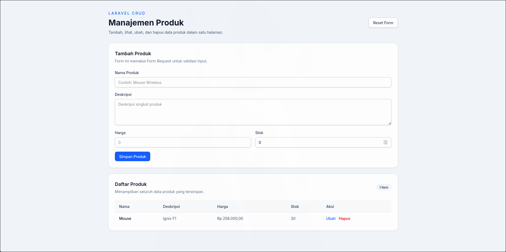
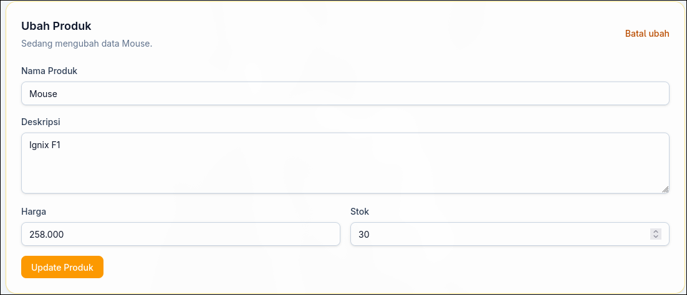
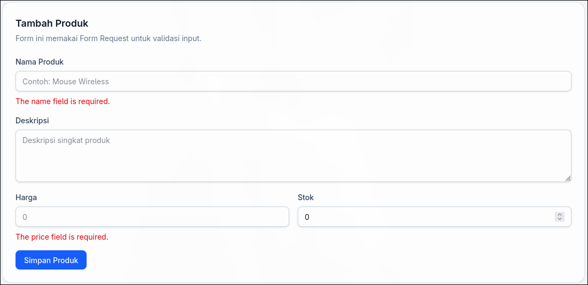

# laravel-basic-repo

Proyek Laravel 13 sederhana yang mengimplementasikan CRUD lengkap untuk entitas **Product**, menggunakan **PostgreSQL** sebagai database.

## Tech Stack

- **PHP** ^8.3
- **Laravel** ^13.0
- **PostgreSQL** (local)
- **Tailwind CSS** v4 via Vite

## Struktur Tambahan

```
app/
├── Http/
│   ├── Controllers/
│   │   └── ProductController.php   # 4 fungsi: index, store, update, destroy
│   └── Requests/
│       ├── StoreProductRequest.php  # validasi form tambah
│       └── UpdateProductRequest.php # validasi form ubah
├── Models/
│   └── Product.php
└── Services/
    └── ProductService.php           # logika create / update / delete

database/
└── migrations/
    └── 2026_04_18_000003_create_products_table.php

resources/views/
└── products/
    └── index.blade.php              # halaman CRUD satu halaman

tests/Feature/
└── ProductCrudTest.php              # 5 test: render, create, validasi, update, delete
```

## Fitur

- **Tambah produk** — Form Request (`StoreProductRequest`) dengan validasi `name`, `description`, `price`, `stock`
- **Tampilkan produk** — Tabel daftar semua produk di sisi kanan halaman
- **Ubah produk** — Form edit muncul inline saat klik tombol **Ubah**
- **Hapus produk** — Konfirmasi browser sebelum delete
- **Service layer** — `ProductService` menangani operasi database, controller hanya mendelegasikan
- **Error handling** — `try/catch` di setiap aksi controller; error dicatat via `Log::error` dan flash message ditampilkan ke user
- **Flash messages** — Notifikasi sukses/gagal setelah setiap aksi

## Setup

### Prasyarat

- PHP ^8.3 dengan ekstensi `pdo_pgsql`
- PostgreSQL (lokal)
- Node.js & npm
- Composer

### Instalasi

```bash
# 1. Clone repo
git clone https://github.com/zhafrandzaky/laravel-basic-repo.git
cd laravel-basic-repo

# 2. Install dependencies
composer install
npm install

# 3. Salin environment
cp .env.example .env
php artisan key:generate

# 4. Buat database PostgreSQL
psql -U <user> -d postgres -c "CREATE DATABASE laravel_basic;"

# 5. Sesuaikan .env
DB_CONNECTION=pgsql
DB_HOST=127.0.0.1
DB_PORT=5432
DB_DATABASE=laravel_basic
DB_USERNAME=<user>
DB_PASSWORD=

# 6. Jalankan migration
php artisan migrate

# 7. Build asset (opsional, untuk tampilan Tailwind)
npm run build
```

### Menjalankan Server

```bash
php artisan serve
```

Buka [http://localhost:8000/products](http://localhost:8000/products).

## Testing

```bash
# Buat database test terlebih dahulu
psql -U <user> -d postgres -c "CREATE DATABASE laravel_basic_test;"

# Jalankan semua test
php artisan test

# Atau hanya test CRUD produk
php artisan test --filter=ProductCrudTest
```

Konfigurasi test menggunakan database `laravel_basic_test` (didefinisikan di `phpunit.xml`).

## Screenshots

### Halaman Utama — Daftar & Tambah Produk


### Form Ubah Produk


### Validasi Error


## Test Manual

Setelah server berjalan, buka browser ke [http://localhost:8000/products](http://localhost:8000/products).

| Aksi | Cara |
|---|---|
| **Tambah produk** | Isi form di kiri → klik **Simpan Produk** |
| **Validasi error** | Kirim form kosong atau harga/stok negatif → pesan error muncul di bawah field |
| **Lihat daftar** | Tabel di kanan menampilkan semua produk secara otomatis |
| **Ubah produk** | Klik **Ubah** di baris produk → form edit muncul di atas tabel |
| **Hapus produk** | Klik **Hapus** → muncul konfirmasi browser sebelum data dihapus |
| **Flash message** | Notifikasi hijau (sukses) atau merah (gagal) muncul di atas halaman setelah setiap aksi |

## Routes

| Method | URI                   | Action    | Name               |
| ------ | --------------------- | --------- | ------------------ |
| GET    | `/products`           | `index`   | `products.index`   |
| POST   | `/products`           | `store`   | `products.store`   |
| PUT    | `/products/{product}` | `update`  | `products.update`  |
| DELETE | `/products/{product}` | `destroy` | `products.destroy` |

## License

[MIT](https://opensource.org/licenses/MIT)
